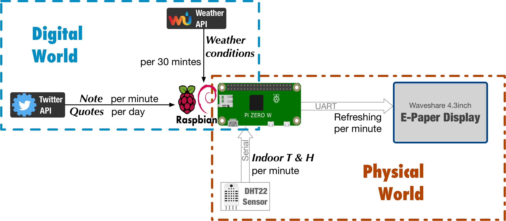
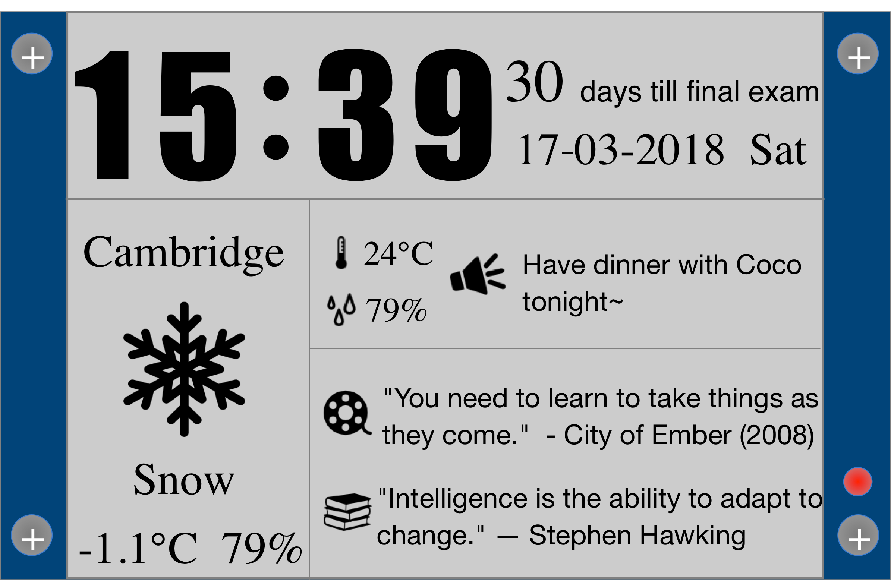

## Epaper-Display

#### v1.3
- Countdown function added back.
- Time digit font Updated. (New bitmap files added)
- Adapt the layout of date section.

##### Diagram

##### Layout

17 March 2018

#### v1.2
- Quotes-section added.
- Left-shifted right-hand section by 10 px.
- Fixed weather string bug(List index out of range when *weather* only contains 1 word e.g.'Clear').
- Altered encoding standard from *GB2312* to *GB18030*. 
- Altered the number of twitter statuses fetched each time, from 10 to 15.

15 March 2018

#### v1.1 
- Weather string truncated.
- Countdown fomula completed.
- Altered waiting time from 20sec into 30sec.
- Replaced countdown feature into twitter direct message.
- Two new modules imported: tweepy & textwrap.

11 March 2018

#### v1.0 Beta 

- weather: length unfixed
- Time: BMP file Dimensions unfixed
- Film section: TBA
- Book section: TBA
- Countdown fomula: TBA

3 March 2018
